# Nutrigreenz — User Flows

> [!NOTE]
> **Original user-flow record, written at the start of the engagement.** All
> twelve flows below were built and are live. Payment steps name Razorpay;
> the gateway shipped as SBIePay, and the sequence is otherwise unchanged.

> 12 flows. Each renders as a self-contained Mermaid diagram at full resolution.
> Aligned to the **official tech stack** (Next.js 14 App Router · Firebase Auth · Postgres row-lock · Razorpay/PhonePe · Brevo · MSG91 · Vercel async background fns). No Medusa / Redis / BullMQ / Meilisearch / Hetzner.
> Click any heading to jump.

- [F1 — Online Customer Onboarding](#f1--online-customer-onboarding)
- [F2 — Stall-Capture Conversion](#f2--stall-capture-conversion)
- [F3 — Browse → PDP → Cart → Checkout](#f3--browse--pdp--cart--checkout)
- [F4 — Checkout 8-Stage Sequence](#f4--checkout-8-stage-sequence)
- [F5 — Loyalty Points Lifecycle](#f5--loyalty-points-lifecycle)
- [F6 — Coupon Lifecycle](#f6--coupon-lifecycle)
- [F7 — Referral Lifecycle](#f7--referral-lifecycle)
- [F8 — Multi-Address Management](#f8--multi-address-management)
- [F9 — Community Bundle Aggregation](#f9--community-bundle-aggregation)
- [F10 — Admin Orders Portal](#f10--admin-orders-portal)
- [F11 — Admin Inventory Portal](#f11--admin-inventory-portal)
- [F12 — Super-Admin Config Flow](#f12--super-admin-config-flow)

---

## F1 — Online Customer Onboarding

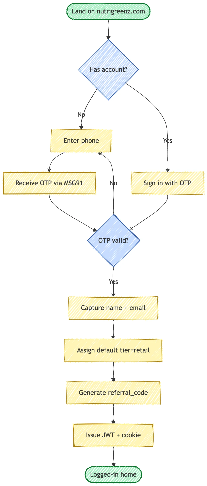

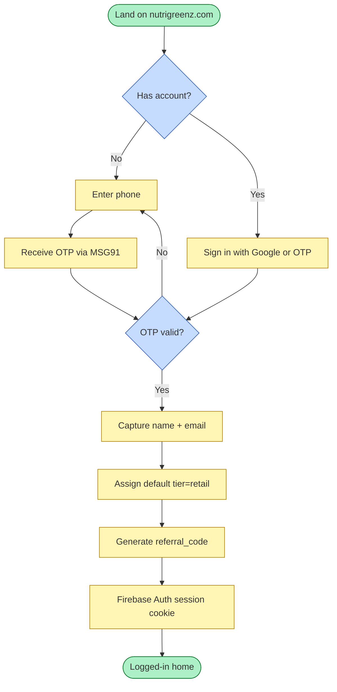
```mermaid
flowchart TB
  S([Land on nutrigreenz.com]) --> B{Has account?}
  B -- No --> R[Enter phone] --> O[Receive OTP via MSG91] --> V{OTP valid?}
  V -- No --> R
  V -- Yes --> N[Capture name + email]
  N --> T[Assign default tier=retail]
  T --> RC[Generate referral_code]
  RC --> J[Firebase Auth session cookie]
  B -- Yes --> L[Sign in with Google or OTP] --> V
  J --> H([Logged-in home])
  classDef start fill:#adf0c7,stroke:#087429
  classDef step fill:#fff6b6,stroke:#af7e02
  classDef branch fill:#c6dcff,stroke:#305bab
  class S,H start
  class R,O,N,T,RC,J,L step
  class B,V branch
```

---

## F2 — Stall-Capture Conversion

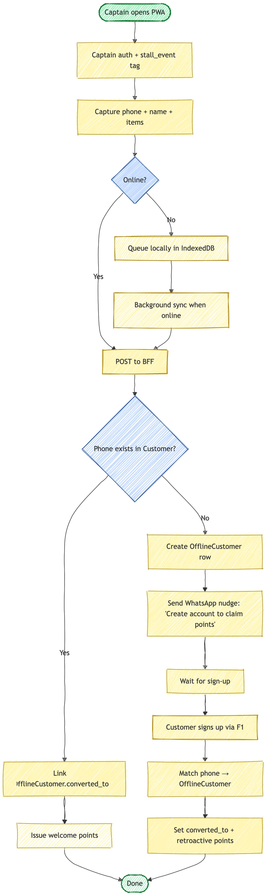

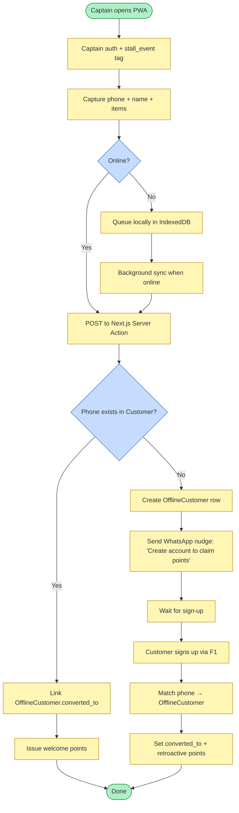
```mermaid
flowchart TB
  S([Captain opens PWA]) --> AUTH[Captain auth + stall_event tag]
  AUTH --> CAP[Capture phone + name + items]
  CAP --> OFF{Online?}
  OFF -- No --> Q[Queue locally in IndexedDB] --> RETRY[Background sync when online]
  OFF -- Yes --> POST[POST to Next.js Server Action]
  RETRY --> POST
  POST --> EXIST{Phone exists in Customer?}
  EXIST -- Yes --> LINK[Link OfflineCustomer.converted_to]
  EXIST -- No --> CREATE[Create OfflineCustomer row]
  CREATE --> NUDGE[Send WhatsApp nudge: 'Create account to claim points']
  LINK --> POINTS[Issue welcome points]
  NUDGE --> WAIT[Wait for sign-up]
  WAIT --> SIGNUP[Customer signs up via F1] --> MATCH[Match phone → OfflineCustomer]
  MATCH --> CONVERT[Set converted_to + retroactive points]
  POINTS --> E([Done])
  CONVERT --> E
  classDef start fill:#adf0c7,stroke:#087429
  classDef step fill:#fff6b6,stroke:#af7e02
  classDef branch fill:#c6dcff,stroke:#305bab
  class S,E start
  class AUTH,CAP,Q,RETRY,POST,LINK,CREATE,NUDGE,WAIT,SIGNUP,MATCH,CONVERT,POINTS step
  class OFF,EXIST branch
```

---

## F3 — Browse → PDP → Cart → Checkout

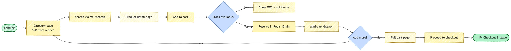

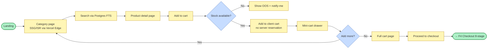
```mermaid
flowchart LR
  L([Landing]) --> CAT[Category page<br/>SSG/ISR via Vercel Edge]
  CAT --> S[Search via Postgres FTS]
  S --> PDP[Product detail page]
  PDP --> ADD[Add to cart]
  ADD --> RES{Stock available?}
  RES -- No --> OOS[Show OOS + notify-me]
  RES -- Yes --> RESV[Add to client cart<br/>no server reservation]
  RESV --> MINI[Mini-cart drawer]
  MINI --> MORE{Add more?}
  MORE -- Yes --> CAT
  MORE -- No --> CART[Full cart page]
  CART --> CHECK[Proceed to checkout]
  CHECK --> F4([→ F4 Checkout 8-stage])
  classDef start fill:#adf0c7,stroke:#087429
  classDef step fill:#fff6b6,stroke:#af7e02
  classDef branch fill:#c6dcff,stroke:#305bab
  class L,F4 start
  class CAT,S,PDP,ADD,OOS,RESV,MINI,CART,CHECK step
  class RES,MORE branch
```

---

## F4 — Checkout 8-Stage Sequence

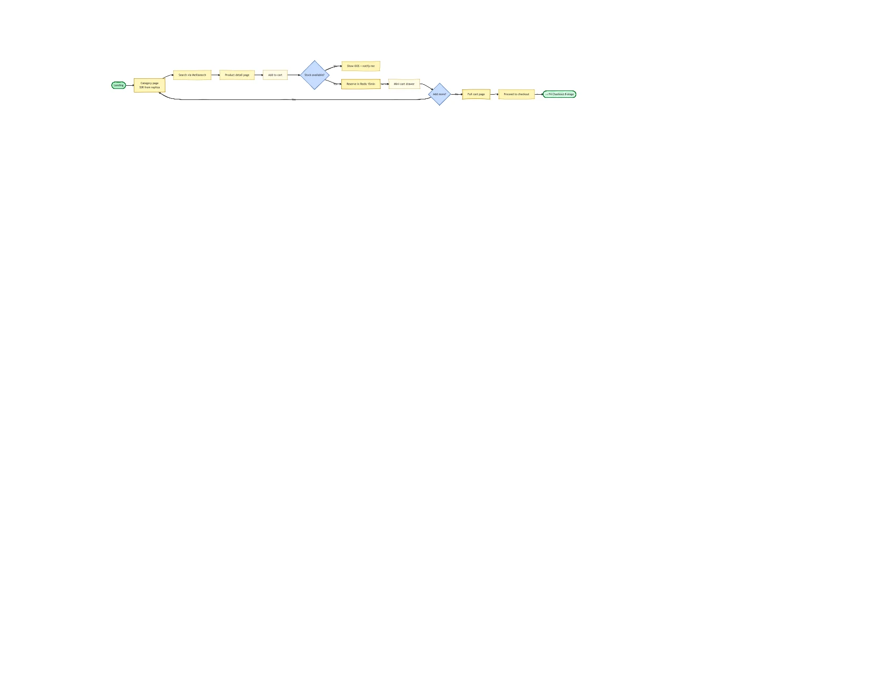

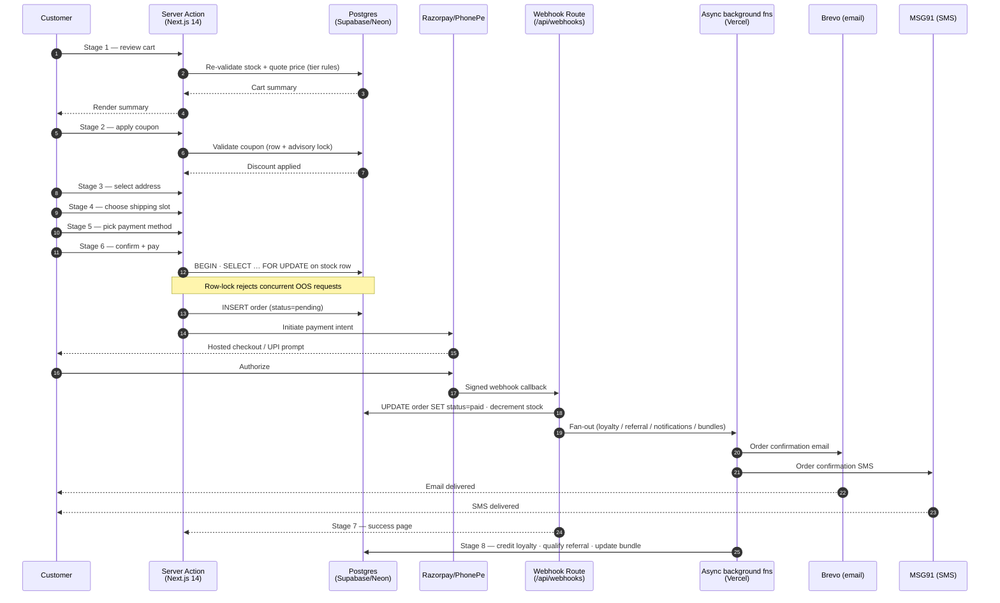
```mermaid
sequenceDiagram
  autonumber
  participant C as Customer
  participant SA as Server Action<br/>(Next.js 14)
  participant DB as Postgres<br/>(Supabase/Neon)
  participant PAY as Razorpay/PhonePe
  participant WH as Webhook Route<br/>(/api/webhooks)
  participant BG as Async background fns<br/>(Vercel)
  participant BR as Brevo (email)
  participant MS as MSG91 (SMS)

  C->>SA: Stage 1 — review cart
  SA->>DB: Re-validate stock + quote price (tier rules)
  DB-->>SA: Cart summary
  SA-->>C: Render summary

  C->>SA: Stage 2 — apply coupon
  SA->>DB: Validate coupon (row + advisory lock)
  DB-->>SA: Discount applied

  C->>SA: Stage 3 — select address
  C->>SA: Stage 4 — choose shipping slot
  C->>SA: Stage 5 — pick payment method

  C->>SA: Stage 6 — confirm + pay
  SA->>DB: BEGIN · SELECT … FOR UPDATE on stock row
  Note over SA,DB: Row-lock rejects concurrent OOS requests
  SA->>DB: INSERT order (status=pending)
  SA->>PAY: Initiate payment intent
  PAY-->>C: Hosted checkout / UPI prompt

  C->>PAY: Authorize
  PAY->>WH: Signed webhook callback
  WH->>DB: UPDATE order SET status=paid · decrement stock
  WH->>BG: Fan-out (loyalty / referral / notifications / bundles)

  BG->>BR: Order confirmation email
  BG->>MS: Order confirmation SMS
  BR-->>C: Email delivered
  MS-->>C: SMS delivered
  WH-->>SA: Stage 7 — success page
  BG->>DB: Stage 8 — credit loyalty · qualify referral · update bundle
```

---

## F5 — Loyalty Points Lifecycle

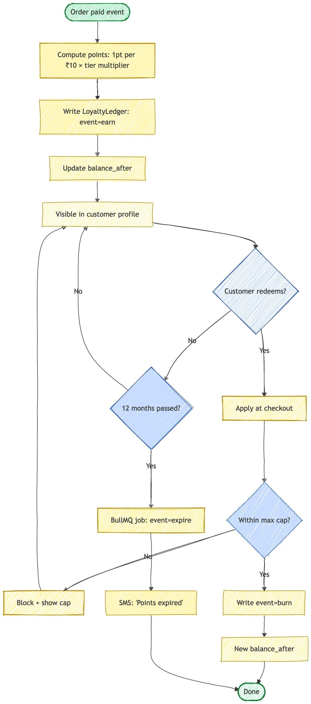

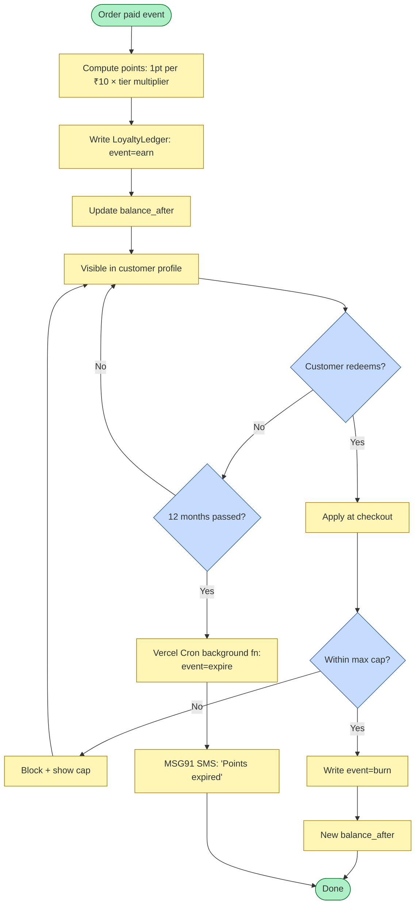
```mermaid
flowchart TB
  E([Order paid event]) --> CALC[Compute points: 1pt per ₹10 × tier multiplier]
  CALC --> W[Write LoyaltyLedger: event=earn]
  W --> BAL[Update balance_after]
  BAL --> SHOW[Visible in customer profile]
  SHOW --> USE{Customer redeems?}
  USE -- Yes --> CART[Apply at checkout]
  CART --> CAP{Within max cap?}
  CAP -- No --> ERR[Block + show cap]
  CAP -- Yes --> BURN[Write event=burn]
  BURN --> NEWBAL[New balance_after]
  USE -- No --> EXP{12 months passed?}
  EXP -- Yes --> EXPIRE[Vercel Cron background fn:<br/>event=expire]
  EXP -- No --> SHOW
  NEWBAL --> END([Done])
  EXPIRE --> NOTIFY[MSG91 SMS: 'Points expired']
  NOTIFY --> END
  ERR --> SHOW
  classDef start fill:#adf0c7,stroke:#087429
  classDef step fill:#fff6b6,stroke:#af7e02
  classDef branch fill:#c6dcff,stroke:#305bab
  class E,END start
  class CALC,W,BAL,SHOW,CART,BURN,NEWBAL,EXPIRE,NOTIFY,ERR step
  class USE,CAP,EXP branch
```

---

## F6 — Coupon Lifecycle

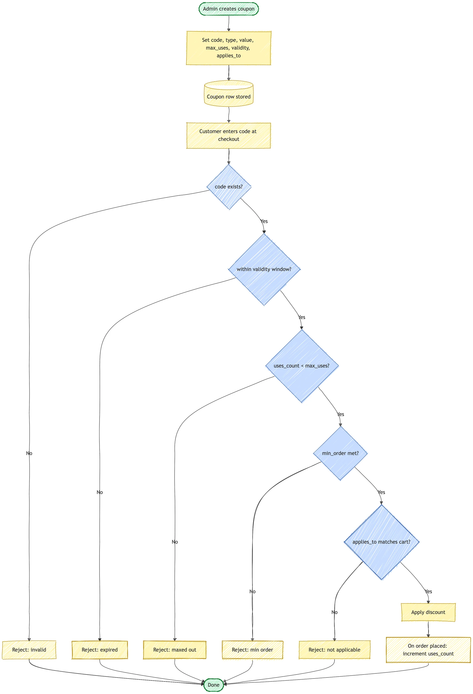

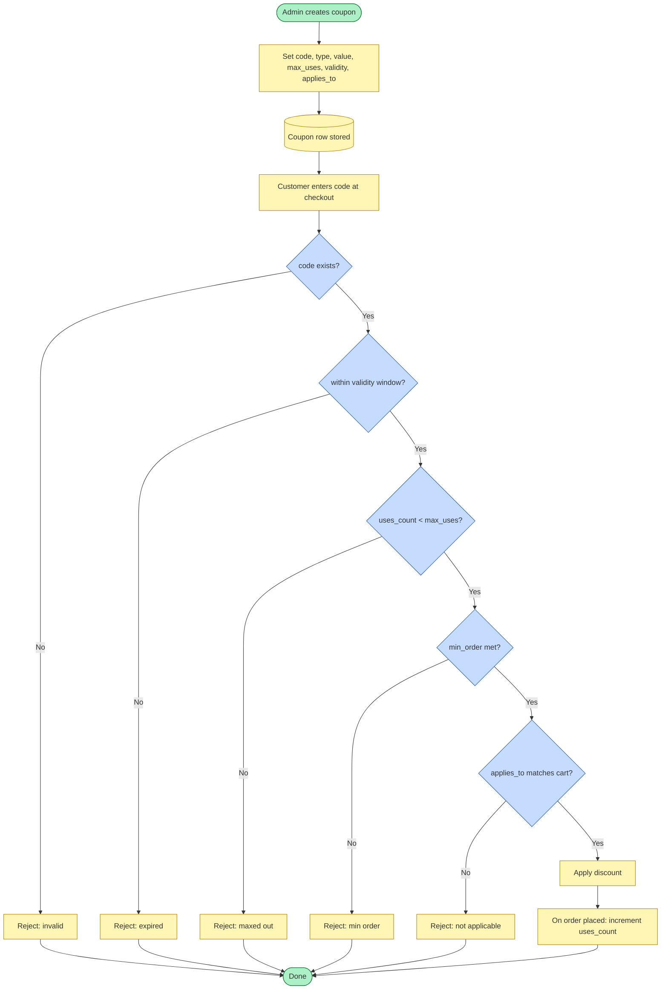
```mermaid
flowchart TB
  CREATE([Admin creates coupon]) --> CFG[Set code, type, value, max_uses, validity, applies_to]
  CFG --> ACTIVE[(Coupon row stored)]
  ACTIVE --> CUS[Customer enters code at checkout]
  CUS --> V1{code exists?}
  V1 -- No --> REJ1[Reject: invalid]
  V1 -- Yes --> V2{within validity window?}
  V2 -- No --> REJ2[Reject: expired]
  V2 -- Yes --> V3{uses_count < max_uses?}
  V3 -- No --> REJ3[Reject: maxed out]
  V3 -- Yes --> V4{min_order met?}
  V4 -- No --> REJ4[Reject: min order]
  V4 -- Yes --> V5{applies_to matches cart?}
  V5 -- No --> REJ5[Reject: not applicable]
  V5 -- Yes --> APPLY[Apply discount]
  APPLY --> ORDER[On order placed: increment uses_count]
  ORDER --> END([Done])
  REJ1 --> END
  REJ2 --> END
  REJ3 --> END
  REJ4 --> END
  REJ5 --> END
  classDef start fill:#adf0c7,stroke:#087429
  classDef step fill:#fff6b6,stroke:#af7e02
  classDef branch fill:#c6dcff,stroke:#305bab
  class CREATE,END start
  class CFG,ACTIVE,CUS,APPLY,ORDER,REJ1,REJ2,REJ3,REJ4,REJ5 step
  class V1,V2,V3,V4,V5 branch
```

---

## F7 — Referral Lifecycle

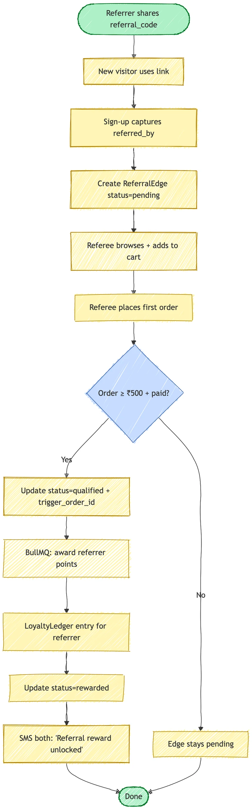

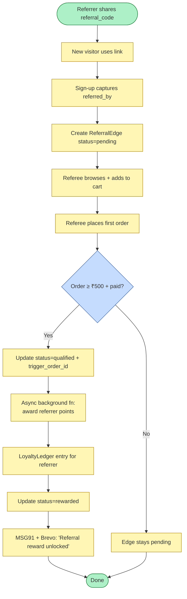
```mermaid
flowchart TB
  R([Referrer shares referral_code]) --> N[New visitor uses link]
  N --> A[Sign-up captures referred_by]
  A --> EDGE[Create ReferralEdge status=pending]
  EDGE --> WAIT[Referee browses + adds to cart]
  WAIT --> ORDER[Referee places first order]
  ORDER --> QUAL{Order ≥ ₹500 + paid?}
  QUAL -- No --> KEEP[Edge stays pending]
  QUAL -- Yes --> Q[Update status=qualified + trigger_order_id]
  Q --> JOB[Async background fn:<br/>award referrer points]
  JOB --> CREDIT[LoyaltyLedger entry for referrer]
  CREDIT --> REW[Update status=rewarded]
  REW --> NOTIFY[MSG91 + Brevo: 'Referral reward unlocked']
  NOTIFY --> END([Done])
  KEEP --> END
  classDef start fill:#adf0c7,stroke:#087429
  classDef step fill:#fff6b6,stroke:#af7e02
  classDef branch fill:#c6dcff,stroke:#305bab
  class R,END start
  class N,A,EDGE,WAIT,ORDER,Q,JOB,CREDIT,REW,NOTIFY,KEEP step
  class QUAL branch
```

---

## F8 — Multi-Address Management

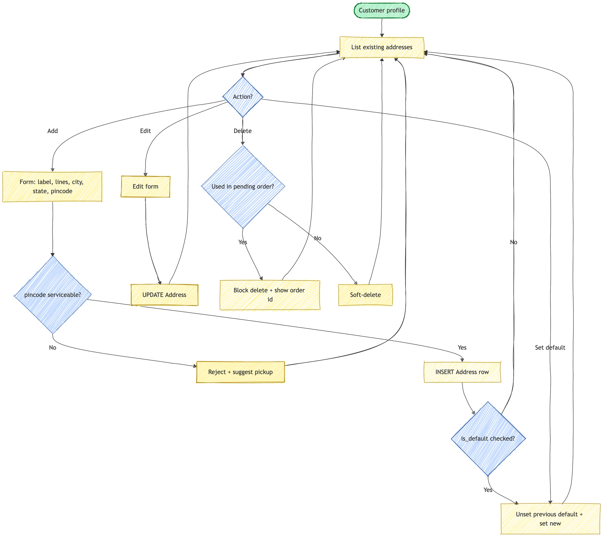

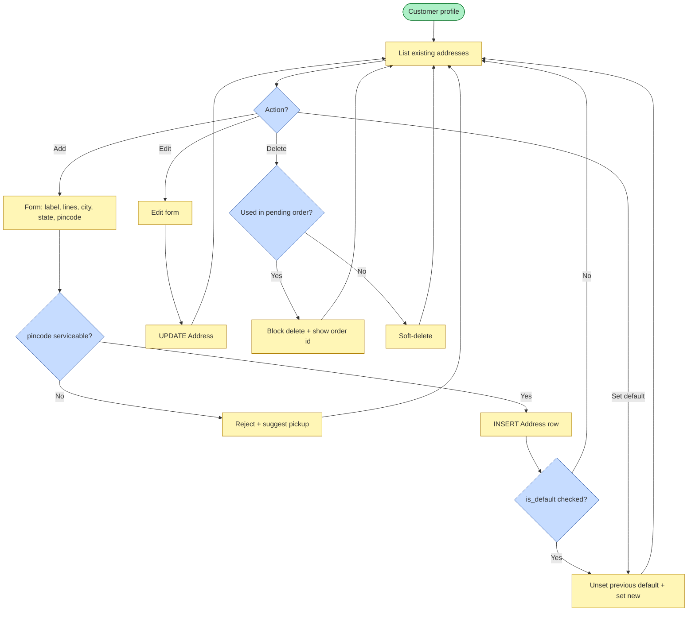
```mermaid
flowchart TB
  S([Customer profile]) --> LIST[List existing addresses]
  LIST --> ACT{Action?}
  ACT -- Add --> ADD[Form: label, lines, city, state, pincode]
  ADD --> PIN{pincode serviceable?}
  PIN -- No --> ERR1[Reject + suggest pickup]
  PIN -- Yes --> SAVE[INSERT Address row]
  SAVE --> DEF1{is_default checked?}
  DEF1 -- Yes --> UNS[Unset previous default + set new]
  DEF1 -- No --> LIST
  UNS --> LIST
  ACT -- Edit --> ED[Edit form]
  ED --> SAVE2[UPDATE Address]
  SAVE2 --> LIST
  ACT -- Delete --> CHK{Used in pending order?}
  CHK -- Yes --> ERR2[Block delete + show order id]
  CHK -- No --> DEL[Soft-delete]
  DEL --> LIST
  ACT -- Set default --> UNS
  ERR1 --> LIST
  ERR2 --> LIST
  classDef start fill:#adf0c7,stroke:#087429
  classDef step fill:#fff6b6,stroke:#af7e02
  classDef branch fill:#c6dcff,stroke:#305bab
  class S start
  class LIST,ADD,SAVE,UNS,ED,SAVE2,DEL,ERR1,ERR2 step
  class ACT,PIN,DEF1,CHK branch
```

---

## F9 — Community Bundle Aggregation

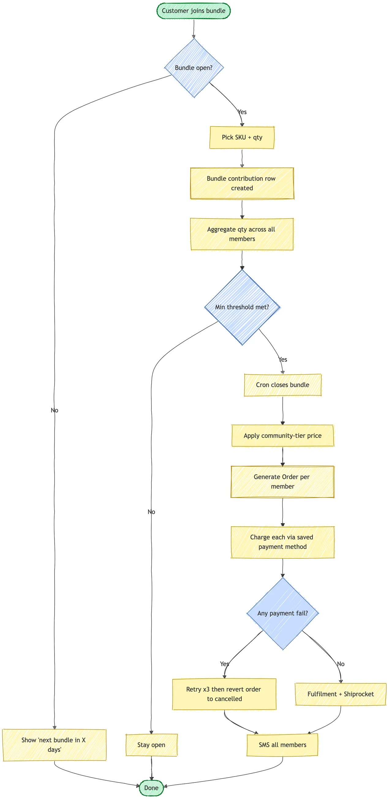

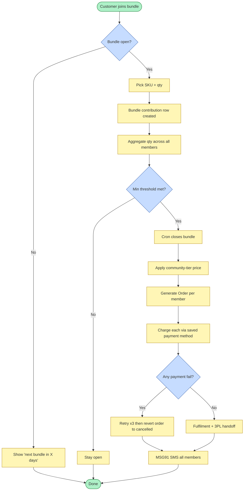
```mermaid
flowchart TB
  S([Customer joins bundle]) --> CK{Bundle open?}
  CK -- No --> WAIT[Show 'next bundle in X days']
  CK -- Yes --> PICK[Pick SKU + qty]
  PICK --> ESC[Bundle contribution row created]
  ESC --> SUM[Aggregate qty across all members]
  SUM --> THR{Min threshold met?}
  THR -- No --> KEEP[Stay open]
  THR -- Yes --> CLOSE[Cron closes bundle]
  CLOSE --> PRICE[Apply community-tier price]
  PRICE --> ORDERS[Generate Order per member]
  ORDERS --> CHARGE[Charge each via saved payment method]
  CHARGE --> ANY{Any payment fail?}
  ANY -- Yes --> RETRY[Retry x3 then revert order to cancelled]
  ANY -- No --> SHIP[Fulfilment + 3PL handoff]
  SHIP --> NOTIFY[MSG91 SMS all members]
  NOTIFY --> END([Done])
  RETRY --> NOTIFY
  WAIT --> END
  KEEP --> END
  classDef start fill:#adf0c7,stroke:#087429
  classDef step fill:#fff6b6,stroke:#af7e02
  classDef branch fill:#c6dcff,stroke:#305bab
  class S,END start
  class WAIT,PICK,ESC,SUM,CLOSE,PRICE,ORDERS,CHARGE,SHIP,NOTIFY,KEEP,RETRY step
  class CK,THR,ANY branch
```

---

## F10 — Admin Orders Portal

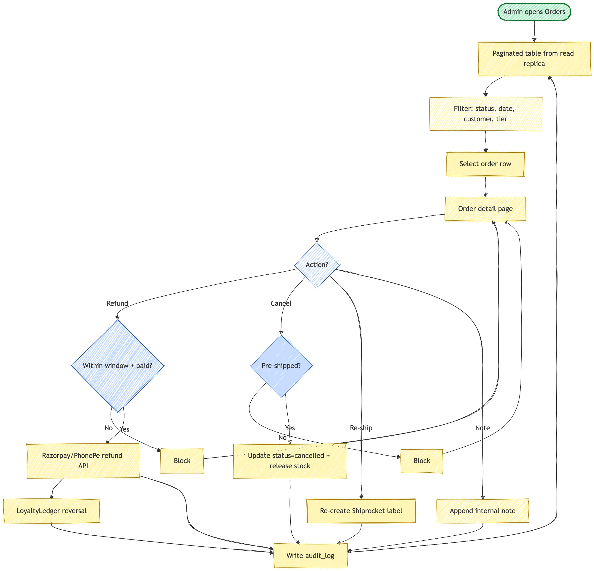

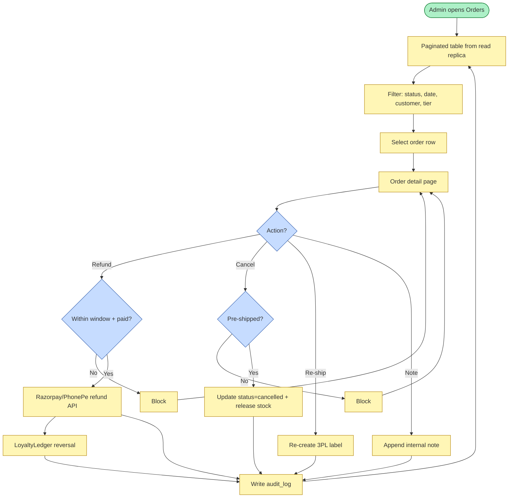
```mermaid
flowchart TB
  S([Admin opens Orders]) --> LIST[Paginated table from read replica]
  LIST --> F[Filter: status, date, customer, tier]
  F --> ROW[Select order row]
  ROW --> DETAIL[Order detail page]
  DETAIL --> ACT{Action?}
  ACT -- Refund --> RF{Within window + paid?}
  RF -- No --> ERR1[Block]
  RF -- Yes --> RG[Razorpay/PhonePe refund API]
  RG --> RLOG[LoyaltyLedger reversal]
  ACT -- Cancel --> CC{Pre-shipped?}
  CC -- No --> ERR2[Block]
  CC -- Yes --> CANCEL[Update status=cancelled + release stock]
  ACT -- Re-ship --> SHIP[Re-create 3PL label]
  ACT -- Note --> NOTE[Append internal note]
  RG --> AUDIT[Write audit_log]
  CANCEL --> AUDIT
  SHIP --> AUDIT
  NOTE --> AUDIT
  RLOG --> AUDIT
  AUDIT --> LIST
  ERR1 --> DETAIL
  ERR2 --> DETAIL
  classDef start fill:#adf0c7,stroke:#087429
  classDef step fill:#fff6b6,stroke:#af7e02
  classDef branch fill:#c6dcff,stroke:#305bab
  class S start
  class LIST,F,ROW,DETAIL,RG,RLOG,CANCEL,SHIP,NOTE,AUDIT,ERR1,ERR2 step
  class ACT,RF,CC branch
```

---

## F11 — Admin Inventory Portal

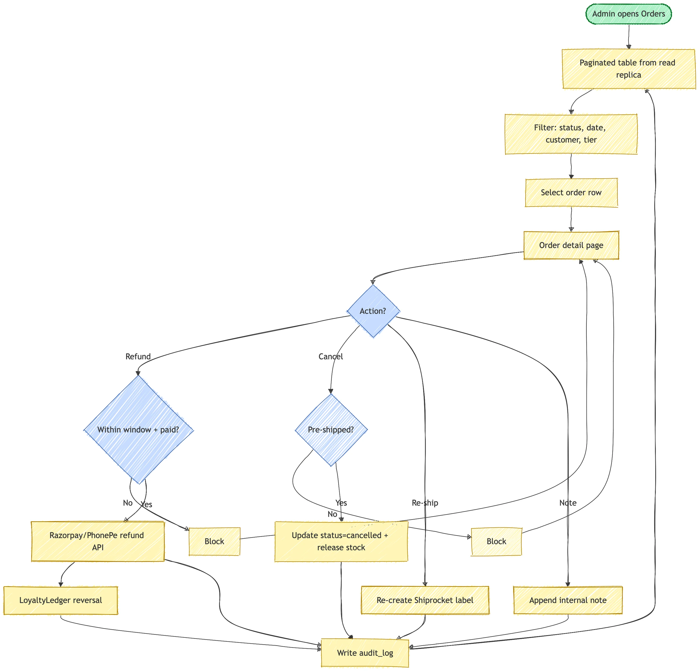

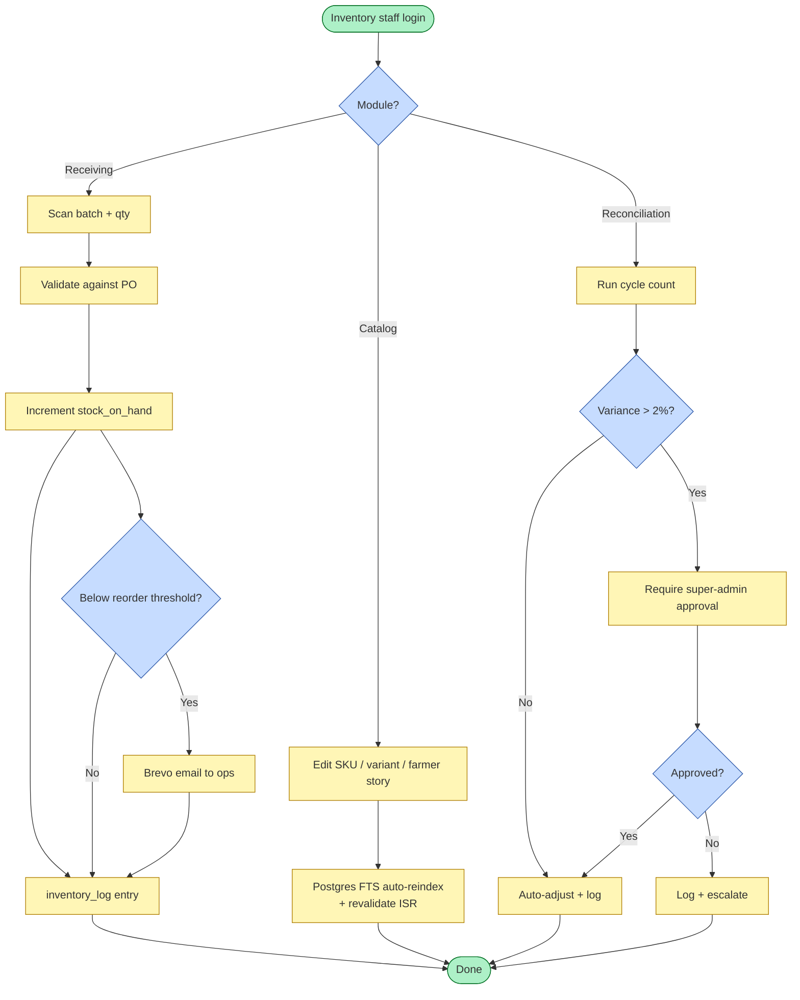
```mermaid
flowchart TB
  S([Inventory staff login]) --> M{Module?}
  M -- Receiving --> R[Scan batch + qty]
  R --> VB[Validate against PO]
  VB --> INC[Increment stock_on_hand]
  INC --> LOG[inventory_log entry]
  M -- Catalog --> C[Edit SKU / variant / farmer story]
  C --> PUB[Postgres FTS auto-reindex<br/>+ revalidate ISR]
  M -- Reconciliation --> RC[Run cycle count]
  RC --> DIFF{Variance > 2%?}
  DIFF -- Yes --> APPR[Require super-admin approval]
  DIFF -- No --> ADJ[Auto-adjust + log]
  APPR --> OK{Approved?}
  OK -- Yes --> ADJ
  OK -- No --> REJECT[Log + escalate]
  INC --> THR{Below reorder threshold?}
  THR -- Yes --> ALERT[Brevo email to ops]
  THR -- No --> LOG
  ALERT --> LOG
  LOG --> END([Done])
  PUB --> END
  ADJ --> END
  REJECT --> END
  classDef start fill:#adf0c7,stroke:#087429
  classDef step fill:#fff6b6,stroke:#af7e02
  classDef branch fill:#c6dcff,stroke:#305bab
  class S,END start
  class R,VB,INC,LOG,C,PUB,RC,APPR,ADJ,REJECT,ALERT step
  class M,DIFF,OK,THR branch
```

---

## F12 — Super-Admin Config Flow

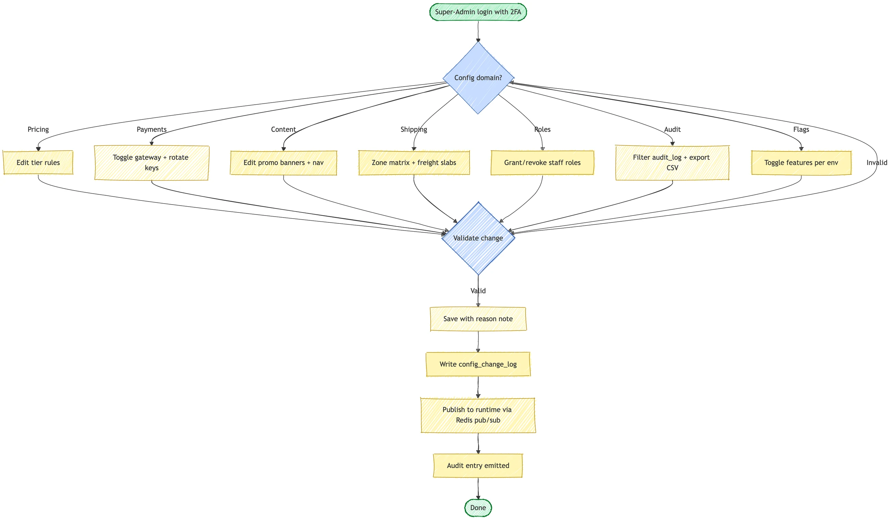

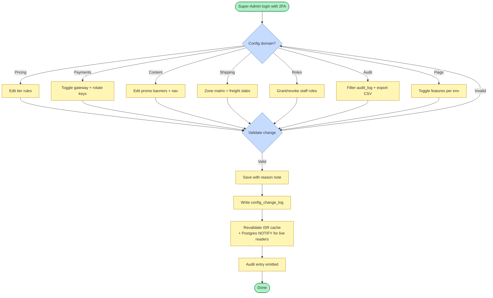
```mermaid
flowchart TB
  S([Super-Admin login with 2FA]) --> D{Config domain?}
  D -- Pricing --> P[Edit tier rules]
  D -- Payments --> PG[Toggle gateway + rotate keys]
  D -- Content --> CT[Edit promo banners + nav]
  D -- Shipping --> SH[Zone matrix + freight slabs]
  D -- Roles --> RL[Grant/revoke staff roles]
  D -- Audit --> AU[Filter audit_log + export CSV]
  D -- Flags --> FL[Toggle features per env]
  P --> V{Validate change}
  PG --> V
  CT --> V
  SH --> V
  RL --> V
  AU --> V
  FL --> V
  V -- Invalid --> D
  V -- Valid --> SAVE[Save with reason note]
  SAVE --> CL[Write config_change_log]
  CL --> PUB[Revalidate ISR cache<br/>+ Postgres NOTIFY for live readers]
  PUB --> AE[Audit entry emitted]
  AE --> END([Done])
  classDef start fill:#adf0c7,stroke:#087429
  classDef step fill:#fff6b6,stroke:#af7e02
  classDef branch fill:#c6dcff,stroke:#305bab
  class S,END start
  class P,PG,CT,SH,RL,AU,FL,SAVE,CL,PUB,AE step
  class D,V branch
```
